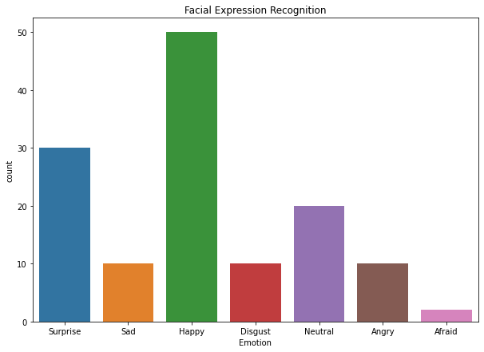

# Real-Time In-Store Sentiment Analysis [RISA]

### Problem Statement
In-Store analytics is very important when it comes to ->
- efficiently managing the product placements.
- optimizing store operations.
- how customers feel when they are inside the store.
- how customers feel when talking to a customer representative(rep).
- customers' overall shopping experience.
- personalizing marketing content 
- recommending relevant producsts
- etc.

Companies/Retailers have been using image/video analysis of in-store customers' interactions to get insights for the above tasks. But, most systems are batch-mode and not real-time. The primary use of real-time is to know instantly how the customer feels and change your course of action based on that. 

### Approach
In this project we will build a Real-Time In-Store Sentiment Analysis system(RISA) to know more about customer's sentiments while they are inside the store. After generating real-time insights of customer's sentiments, the store owner can work on cutomer loyalty and engagement programs. 

- Step 1 - Collect facial data of customers from images/videos using camera feed/Raspberry Pi etc.
- Step 2 - The facial crops are then classified as one of the categories (Happy, Sad, Neutral etc.) for each person.

### Technical Solution
We have prototyped it as a two step process a **Face Detection** followed by **Facial Expression Recognition**. 

To achieve the Face Detection , there are many methods available and each has pros and cons in terms of accuracy, latency etc.:
- [HAAR Cascade Classifier](https://docs.opencv.org/3.4/db/d28/tutorial_cascade_classifier.html)
- MTCNN (Facenet-pytorch)
- [DLib(HOG/CNN)](http://dlib.net/) / [face_recognition](https://github.com/ageitgey/face_recognition)

For Facial Expression Recognition, we can use any classifier:
- Pretrained classifiers
- Train from scratch

Whatever we choose, we must have low latency inference as we would like to generate real-time insights. 

There are various datasets avilable for use:
- FER-2013
- FER+ 
- CK+ (extended Cohn-Kanade).
- etc.

<caption>
 
</caption>
<caption>
 <u><b>Figure 2</u></b>: This figure shows real-time distribution of emotions per customer present in store  
</caption>

/////////////////diagram

reference: 
https://www.kaggle.com/timesler/comparison-of-face-detection-packages

https://towardsdatascience.com/face-detection-recognition-and-emotion-detection-in-8-lines-of-code-b2ce32d4d5de

https://ieeexplore.ieee.org/document/9091188

### Conclusion

Prototyped Facial Expression Recognition system for in-store customer analytics.

Achieved 89% accuracy using OpenCV for detecting facial bounding boxes and TensorFlow for multi-class classification of expressions trained on FER-2013 dataset.

